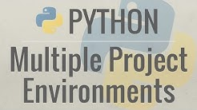

# Backscattergraph tool 

## Aim

This small command line tool aims to create backscatter graphs of decibel values for every observation
of sentinel-1 datasets (datasets must be preprocessed).

## Parameters

The input is a directory containing json files which store the statistics (mean, median, min, max, etc.)
of samples with a class label and their values in a sentinel-1 band. 

The following code shows how the json file should be structured internally for the tool to work:

```{{"cid":{"0":1,"1":0,"2":1, "3":0},
{"mean": {"0": 0.155, "1": 0.175, "2": 1.883, "3": 1.992}}}
```

## Command Line Arguments


| Arguments |           |  Definition                               |
|-----------|-----------|-------------------------------------------|
|    -i     |--infolder | Folder containing the json files: string  |
|    -o     |--outfolder| Output directory where results will be stored|                                  |
|    -t     |--title    | Title of the graph that will be created   |
|    -b     |--band     | Polarization band the stats were extracted|


## Example of the graph generated:


## Usability

This type of graph have beeing used in SAR research as a data preliminary data exploration to check the
behaviour of the backscatter response for different land cover types. This can be useful to stablish 
time windows that favour the classification of target classes with sentinel-1 dataset. 


## Results 

The results are a backscatter plot with the decibel values in the y axis and the observation date 
from which the statistic is calculated. Remember that the statistic is based on all the samples for a
given observation. A csv file is generated with the following information:


Boxplots are created for every sentinel-1 observation:


## Usage

With the dataset provided in this repository in the "VH", you can create the results already described with the following
command line arguments:

```python backscattergraph.py -i "VH" -o "results" -t "VH Backscatter Values in db 2017 2018" -b "VH"```

The backscatter graph has to be stored manually after it pops
up. The boxplots and csv file are automatically stored in the 
output folder. 

## Environment 

env.yml provides the explicit path to the packages installed in the environment used 
to run the script.

You can reproduce a similar environment by running

```conda create --name env --file env.yml```

For information about environment management in anaconda
you can check the following documentation:

(https://docs.conda.io/projects/conda/en/latest/user-guide/tasks/manage-environments.html)

Or check out the following video created by Corey Schafer
about environment management using conda:

<a href="https://www.youtube.com/watch?v=cY2NXB_Tqq0&t=659s"
target = "_blank"></a>
